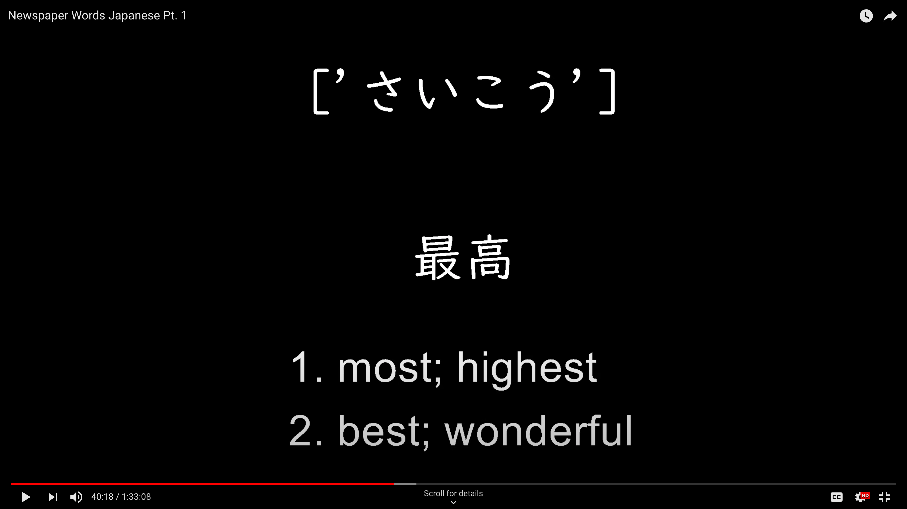

# Vocabulary Video Generator (Japanese)

## Description:
A series of scripts that will allow for easier automation in creating 
Japanese-English vocabulary videos with audio using the WWWJDIC
online Japanese-English dictionary. Click on the image above to see a sample.

## Scripts:
### "1-wwwjdic-xml-filter.py"
Reads the "JMdict_e" - the JMdict file with only English glosses and
extract all the kanji, kana, and English meanings.
The meanings are also filtered by commonly used words and words where
kana is used more often than the corresponding kanji.

Useful websites:
* http://www.edrdg.org/wiki/index.php/JMdict-EDICT_Dictionary_Project
* http://nihongo.monash.edu/wwwjdicinf.html#code_tag

### "2-comparison-lists.py"
Using the Ordered Dictionaries of Japanese words produced in previous scripts,
we can order the words from most commonly used to least commonly used.

This works by:
1. We have a file called "unidic.csv" that contains Japanese words ordered from most
   to leased used (according to number of hits on Yahoo search). However, there are no
   English meanings included: only kanji and kana.
2. We need to compare the Japanese words in our Ordered Dictionaries we previously made to the
   order of the words in the unidic file. But, the Ordered Dictionaries are still very messy, and
   have lots of uncommon kanji and kana. The chance of not finding many results in Yahoo search for
   these uncommon words is high. However, the kanji and kana appear in the Ordered Dictionaries
   from most commonly used to least commonly used. i.e. the first kanji or kana to appear in each
   entry is the most commonly-used.
3. We need to make a series of four "comparison lists" that become less and less stringent with how many
   kanji or kana are included for each entry. For entries that more commonly use kana, we'll use the 'uk'
   tag to replace the kanji with the kana.
4. Using the unidic file, we compare the word on each line (from most common to least common) to the
   entries in our "comparison lists". If a match is found using the most stringent comparison list,
   then the corresponding entry in the "xml_import" or "xml_common_filt" list of Ordered Dictionaries
   is added to a "match_list". If no match is found, the word in the unidic file will then be compared
   to the words in each "comparison list" incrementally from most stringent to least stringent.

### "3-word-filter.py"
Filters the Ordered Dictionaries and turn them into regular lists. There is a kanji list,
a kana list, and an English list with a certain number of definitions.

### "4-audio-file-generate.py"
This script will take the word lists previously generated and
generate .mp3 files for the Japanese, Japanese pronunciation
(with each syllable separated), and English pronunciation using
Google's text-to-speech.

### "5-srt-file-generate.py"
This script will use the audio files generated in the previous script
to automatically read the length of all mp3 files and generate an .srt
subtitle file that can be imported into a video editing software along
with the audio files.

## Future updates and known issues:
* Currently, the script will generate audio files and separate .srt subtitle files
that can be imported into video editing software and immediately rendered. In future,
I hope to be able to generate the video using only Python using a library such as
moviepy or OpenCV.
* Sometimes text is cut off and doesn't wrap automatically. In future, I'll aim to
implement a fix for this using moviepy or OpenCV.